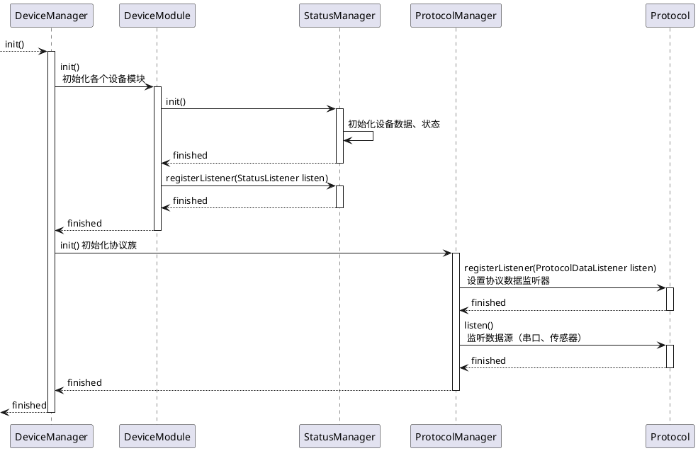

# aa

```plantuml

@startuml

participant DeviceManager

participant DeviceModule

participant StatusManager

participant ProtocolManager

participant Protocol

--> DeviceManager : init()

activate DeviceManager

DeviceManager -> DeviceModule : init() \n 初始化各个设备模块

activate DeviceModule

DeviceModule -> StatusManager : init()


activate StatusManager

StatusManager -> StatusManager : 初始化设备数据、状态

StatusManager --> DeviceModule : finished

deactivate StatusManager

DeviceModule -> StatusManager : registerListener(StatusListener listen)

activate StatusManager

StatusManager --> DeviceModule : finished

deactivate StatusManager

DeviceModule --> DeviceManager : finished

deactivate DeviceModule

DeviceManager -> ProtocolManager : init() 初始化协议族

activate ProtocolManager

ProtocolManager -> Protocol : registerListener(ProtocolDataListener listen) \n 设置协议数据监听器

activate Protocol

Protocol --> ProtocolManager : finished

deactivate Protocol


ProtocolManager -> Protocol : listen() \n 监听数据源（串口、传感器）

activate Protocol

Protocol --> ProtocolManager : finished

deactivate Protocol

ProtocolManager --> DeviceManager : finished

deactivate ProtocolManager

<-- DeviceManager : finished

deactivate DeviceManager

@enduml

```

> this is md

* ddd
* afa
* adgt
* asdf